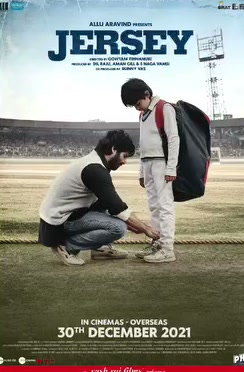

# 🎬 Movie Draft & Auction

A live **Movie Draft & Auction Game** inspired by Telugu cinema. Draft lineups from 22 heroes and 21 heroines with bidding, the *"Teesko!"* pass rule, live emoji reactions, and online rooms across devices.



---

## ✨ Features

- 🎮 **Online rooms for 2–5 players**: The creator chooses the room size and shares a code or invite link. The lobby shows who has joined, and the draft starts automatically when everyone is connected; the host can also tap Start Movie Draft. The host validates bids and sends a shared room state to every device.
- ⚡ **WebRTC rooms**: PeerJS DataChannels connect players on Vercel and during local development. The host needs to keep their browser tab open for the room to stay available.
- 📱 **Mobile & touch layout**: Online rooms put the film poster and your bidding paddle in focus, with a scrollable lineup strip on small screens.
- 🍿 **Authentic Auction Mechanics**:
  - Choose a ₹20–₹100 starting budget and 5–7 movies per player (defaults: ₹20 and 5).
  - Bid increments (+₹1, +₹2) with authentic sound effects.
  - *"Teesko!"* pass rule to award the film to the high bidder.
  - Auto-claim rules when an opponent is full or bankrupt (₹0).
- 🤖 **vs AI Mode**: Play solo against an intelligent AI drafter.
- 🎬 **43 actor catalogs**: Released lead and substantial co-lead films only. Movies can recur across players when a room needs more picks than the catalog contains. For actors with fewer films than the chosen slot count, films can repeat within a lineup. Local poster files are used where available; a title card fills the remaining gap.
- 🏆 **Shareable results**: Export a portrait image of all lineups for Instagram and ask friends to comment which player drafted best.

The added film credits were checked against published actor filmographies, including [Nani's](https://en.wikipedia.org/wiki/Nani_filmography), [Allu Arjun's](https://en.wikipedia.org/wiki/Allu_Arjun_filmography), [Samantha Ruth Prabhu's](https://en.wikipedia.org/wiki/Samantha_Ruth_Prabhu_filmography), and [Nagarjuna's](https://en.wikipedia.org/wiki/Nagarjuna_filmography). Cameos, child roles, voice-only work, and unreleased films are excluded. Added poster images were fetched from the corresponding Wikipedia file pages with `scripts/fetch_filmography_posters.py`.

---

## 🚀 Quick Start

### 1. Clone the repository
```bash
git clone https://github.com/vamshicreates/movie-draft.git
cd movie-draft
```

### 2. Install dependencies & Run
```bash
npm install
npm run dev
```

Open [http://localhost:3040](http://localhost:3040) in your browser.

---

## 🚢 Deploy to Vercel

Deploy the repository to Vercel with the **Other** framework preset. The committed
`vercel.json` runs `npm run build` and serves `dist/`, which contains `index.html`,
the JavaScript and CSS, and the posters, sound, and video assets. This explicit
output folder is necessary because Vercel otherwise serves only `public/` when
that directory exists, leaving the homepage at `/` unavailable.

You can deploy through the Vercel dashboard:

[](https://vercel.com/new)

Or run:
```bash
npx vercel
```

Vercel hosts the static site; online rooms use the browser's PeerJS/WebRTC
transport. `npm run dev` serves the same site locally.

---

## 📜 License
MIT License. Built for cinema lovers.
